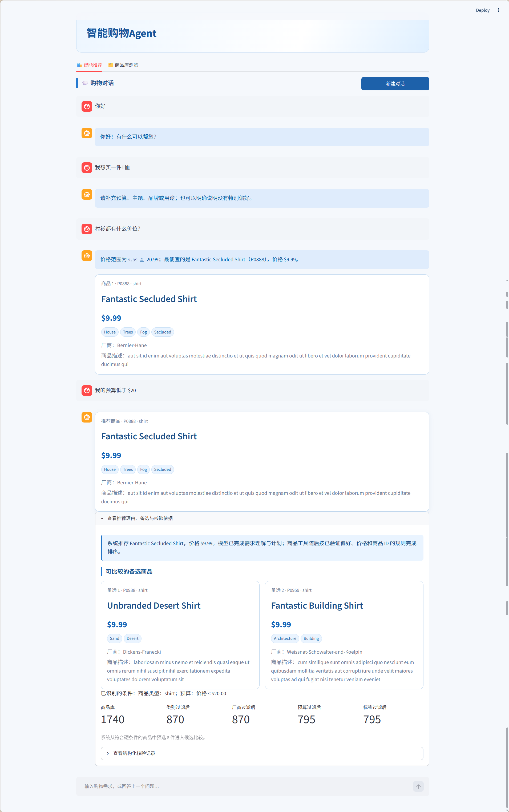
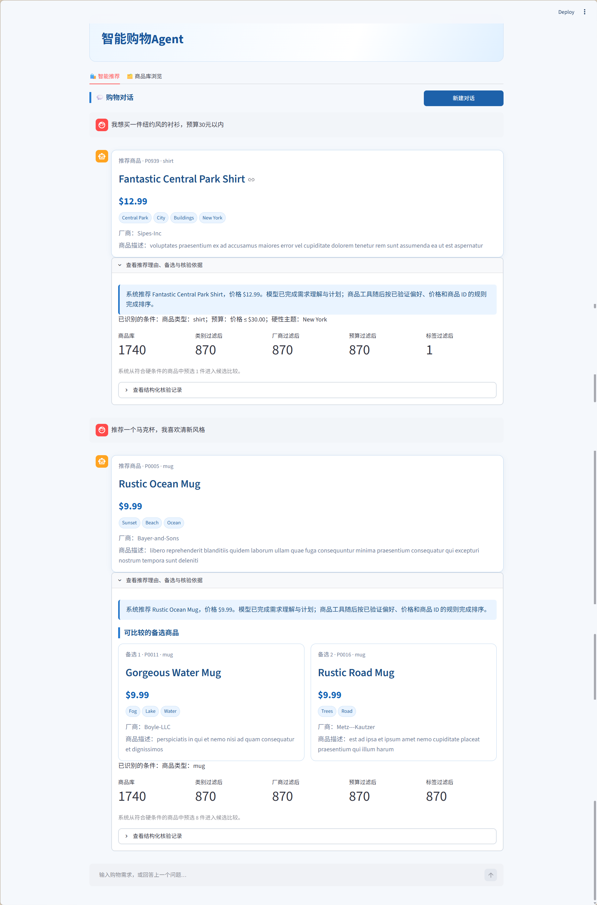

# 智能购物 Agent

基于 DeepSeek API 和本地商品目录实现的购物 Agent。系统使用大模型理解用户意图并生成受限的 `TurnPlan`；代码负责会话状态、目录检索、硬约束校验、候选排序和结果可追溯性。

## 核心工作流

```text
用户消息
  → DeepSeek：TurnPlan 语义规划
  → 计划契约校验 / 一次协议修复
  ├─ 聊天                 → 自然回复
  ├─ 目录信息查询         → 真实目录聚合
  ├─ 商品详情或比较       → 校验商品 ID 后只读返回
  ├─ 购物推荐             → 状态归约 → 硬过滤 → 确定性排序
  └─ 订单/支付等动作      → 能力注册表检查
```

推荐只会在模型规划成功后执行；硬条件由商品库验证，候选稳定按“已验证偏好 → 价格从低到高 → 商品 ID”排序。没有有效模型计划时，系统不会以本地规则启动检索或伪造推荐。

## 项目结构

```text
app.py                         # Streamlit 页面入口
starter/agent_interface.py     # Agent、提示词、状态、工具与校验
data/
  products.jsonl               # 1,740 件商品
  tasks.jsonl                  # 50 条公开评测任务
  metadata.json                # 数据来源与许可证
tests/
  test_product_repository.py   # 离线回归测试
  test_live_api_smoke.py       # 可选真实 API 冒烟测试
  task_evaluation.py           # 50 条任务评测及报告生成器
docs/
  experiment-report.md         # 实验报告：模型、工作流、提示词与工具设计
  task-evaluation.md           # 测试报告：50 条评测与人工核验记录
  任务1_Agent工作流构建_题目.md # 题目原文
  screenshots/                 # 人工核验截图
```

## 安装与配置

需要 Python 3.10+。

```bash
python -m venv .venv
```

Windows PowerShell：

```powershell
.\.venv\Scripts\Activate.ps1
pip install -r requirements.txt
Copy-Item .env.example .env
```

编辑 `.env`：

```env
DEEPSEEK_API_KEY=your_api_key_here
DEEPSEEK_MODEL=deepseek-v4-pro
DEEPSEEK_TIMEOUT_SECONDS=45
DEEPSEEK_MAX_RETRIES=1
```

`.env` 已被 Git 忽略，禁止提交真实 API Key。

## 运行

```bash
streamlit run app.py
```

浏览器打开命令行显示的本地地址（默认 `http://localhost:8501`）。点击“新建对话”可开启独立会话；推荐结果可展开查看候选商品、约束过滤数量和结构化核验记录。

## 测试与结果

离线回归：

```bash
python -m unittest discover -s tests -v
```

当前基线：测试套件共 60 项，其中 **59 项离线回归通过**；另有 1 项真实 API 冒烟测试默认跳过。

执行 50 条公开任务评测（会调用真实 DeepSeek API）：

```bash
python tests/task_evaluation.py --output outputs/task-evaluation.json --markdown-output docs/task-evaluation.md
```

最新评测结果：**50/50 通过，成功率 100%**。评测会核验实际返回商品的类型、主题、预算、严格厂商条件、可用优先厂商，以及 trace 中的确定性候选排序。逐项结果与人工核验记录见 [测试报告](docs/task-evaluation.md)。

## 人工核验展示

| 场景 | 验证点 | 截图 |
| --- | --- | --- |
| 目录查询后继续推荐 | 浏览任务不覆盖购物状态 | R01 |
| 衬衫切换为马克杯 | 新任务替换旧条件，无状态泄漏 | R02 |
| Ocean mug + 优先厂商 | 硬约束与软偏好共同生效 | R03 |
| 展开推荐依据 | 软偏好与确定性排序可审阅 | R04 |
| 商品详情与比较 | 真实 ID 驱动的只读工具调用 | R05 |
| 商品库浏览 | 分页、关键词检索与按商品类型筛选 | R06 |

六个场景的输入、关键处理过程和结果说明见 [测试报告](docs/task-evaluation.md#代表性人工运行记录)。

<details>
<summary>展开查看 6 张人工核验截图</summary>






</details>

## 提交文档

- [实验报告](docs/experiment-report.md)：大模型使用方式、工作流、工具/提示词设计、结果与局限性。
- [测试报告](docs/task-evaluation.md)：50 条公开任务逐项结果与 6 个代表性人工运行记录。
- [题目原文](docs/任务1_Agent工作流构建_题目.md)：任务要求与提交材料说明。

## 数据来源与边界

`data/products.jsonl` 来自 [stockholmux/ecommerce-sample-set](https://github.com/stockholmux/ecommerce-sample-set)，许可证为 Creative Commons Attribution-Share Alike 3.0 Unported。商品库规范值和描述保留上游英文数据。

系统当前支持商品查询、比较和推荐；订单创建、支付和取消订单已被建模为受控动作，但能力注册表明确标记为未实现，不会伪称操作成功。
