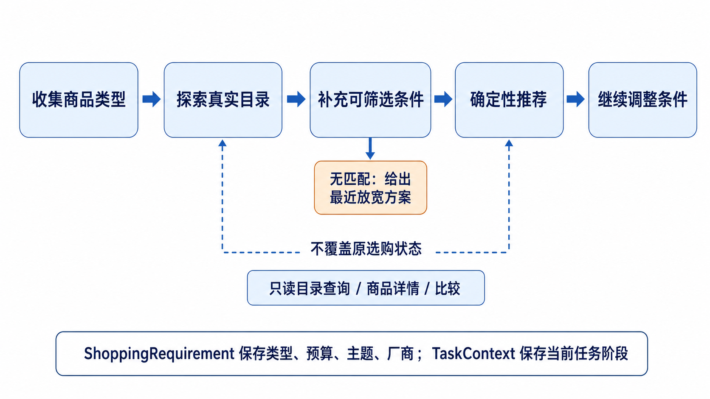

# 智能购物 Agent 实验报告

## 摘要

本项目实现了一个面向本地商品库的自然语言购物 Agent。系统使用 DeepSeek API 理解用户意图并生成受限的单轮计划（`TurnPlan`），由 Python 程序完成商品库检索、约束校验、候选排序、会话状态更新和结果展示。商品库包含 1,740 件商品，其中马克杯（`mug`）和 T 恤（`shirt`）各 870 件。

设计重点是把“开放语义理解”与“可验证商品事实”分开：大模型不直接生成商品事实，也不决定最终商品；程序不尝试用规则取代自然语言理解，而是只对商品库事实、状态迁移和业务边界作确定性处理。系统支持中英文多轮对话、目录浏览、商品详情与比较、硬约束/软偏好排序，以及未实现交易动作的边界说明。

截至 2026-08-09，50 条公开购物任务的真实 API 评测结果为 50/50 通过；本地回归共发现 104 项测试，其中 103 项通过，1 项真实 API 冒烟测试按默认配置跳过。新增的价格区间测试覆盖了“10 元以上、20 元以下”等多轮补充条件，避免目录查询词触发错误分流。

## 1. 任务理解与目标

题目要求构建一个可运行的购物 Agent，完成需求理解、商品搜索、候选比较、约束检查、购买决策和结果说明，并提交代表性运行记录与实验报告。本项目将目标细化为以下五项：

1. 将中英文自然语言映射为可审计的结构化需求；
2. 只依据 `products.jsonl` 中的真实字段筛选、比较和展示商品；
3. 支持多轮填槽，使用户无需一次说完商品类型、预算、主题和厂商；
4. 把目录查询、商品详情、比较、推荐和交易请求区分为不同的受控工作流；
5. 对模型输出、无结果和未实现能力保持可解释、可复现和诚实的失败边界。

本商品库只包含 `item_type`、`manufacturer`、`price`、`tags` 和 `description` 等字段。因此，系统只引导用户补充能够映射到这些字段的条件，避免询问无法参与检索的“材质”“续航”等无效信息。

## 2. 系统总体架构

系统由四层组成：

| 层次 | 主要组件 | 职责 |
| --- | --- | --- |
| 交互层 | `app.py`、Streamlit | 显示对话、加载状态、推荐/目录/详情卡片和核验记录；用户消息立即显示，接口返回前展示“正在分析需求”状态。 |
| 规划层 | DeepSeek、`TurnPlan` | 判断本轮目标、目标对象、需求增量和只读操作；不产生商品事实。 |
| 编排层 | `ShoppingAgent`、状态机 | 校验计划、维护事件、决定澄清/探索/推荐阶段并路由到受控工具。 |
| 数据与决策层 | `ProductRepository` | 目录接地、硬过滤、统计、详情/比较、最近放宽建议和稳定排序。 |

图 1 展示了系统的总体架构。模型只参与受限计划生成，检索、排序和展示依据均由本地目录和代码生成。

## 3. 工程代码与大模型的职责划分

“哪些能力交给模型、哪些能力交给代码”是本项目的核心取舍。判断原则是：语义存在开放性和歧义时使用模型；答案必须可枚举、可验证、有副作用或需要稳定复现时使用代码。

| 能力 | 实现方式 | 原因 |
| --- | --- | --- |
| 意图识别与中英文表达理解 | 大模型规划，规则提供强信号 | “想买”“查价”“比较”“下单”等表达多样，模型更适合综合上下文。 |
| 商品类型、主题、厂商的目录对齐 | 模型提出候选，代码按目录验证 | 模型可理解“马克杯”“Ocean 风格”，但只有目录中的规范值可以成为已满足事实。 |
| 商品检索与统计 | 本地代码 | 数量、价格、标签和厂商必须来自真实商品库。 |
| 硬约束判断 | 本地代码 | 类型、预算、明确主题、明确厂商不允许由模型臆测满足。 |
| 软偏好排序 | 本地代码 | 按“已验证偏好命中 → 价格升序 → 商品 ID”排序，结果可重复。 |
| 多轮状态更新 | 事件日志与 reducer | 防止目录查询、详情查询污染尚未完成的购物任务。 |
| 支付、下单、取消 | 能力注册表 | 当前未接入交易系统，必须返回能力不可用，不能声称操作成功。 |

这种分工避免了两个极端：一是让大模型直接“挑一件商品”而无法解释事实来源；二是用关键词规则替代全部自然语言理解，导致中英文和上下文表达过于脆弱。

## 4. 受限计划与输出约束

每个正常的用户回合由 DeepSeek 生成一个 `TurnPlan`。计划是声明式的，只描述“要做什么”，不携带未经验证的商品结果。关键字段如下：

| 字段 | 含义 |
| --- | --- |
| `goal` | `chat`、`information`、`selection` 或 `action` |
| `target` | `none`、`catalog`、`product` 或 `transaction` |
| `requirement` | 商品类型、厂商、价格、主题等需求增量 |
| `catalog_operations` | 允许的目录聚合，如 `count`、`list`、`price_range` |
| `state_action` | `none`、`merge` 或 `replace`，描述如何更新选购状态 |
| `selection_mode` / `action` | 开放式推荐或受控交易动作 |
| `goal_evidence` | 对高风险动作的用户授权证据 |

接口层使用 `response_format={"type": "json_object"}` 要求模型返回 JSON 对象；随后由 `TurnPlan.from_dict()`、枚举校验、字段组合校验、强意图一致性校验和目录接地校验构成第二道防线。上表即为项目采用的 JSON Schema 核心字段：它用于限定类型、枚举与空值边界；若迁移到支持原生 `json_schema` 响应格式的模型服务，可直接将该契约作为服务端约束输入。

需要说明的是，当前 DeepSeek 调用并非仅依赖服务端 `json_schema`：服务端负责“返回 JSON 对象”，业务代码仍负责跨字段规则和商品库事实。例如，`goal=action` 必须对应交易目标，价格下界不能高于上界，未知主题不能被当作已满足。这种双重约束比只依赖提示词更稳健。

当模型输出不符合协议时，系统只会在尚未检索、尚未写入业务状态的阶段发起一次“协议修复”调用；修复后仍无效则返回 `service_error`，不再用猜测替代模型计划。

## 5. Agent 工作流设计

### 5.1 主工作流

工作流遵循“检索优先于无效追问”。当用户只说“我想买一个马克杯”时，系统已具备商品类型，不会强迫其一次给完预算、主题和厂商；它先展示该类目的真实价格范围、常见标签和目录样例，并用自然语言邀请用户继续收窄。只有商品类型未知、价格表达不完整或输入自相矛盾时才进行澄清。

### 5.2 状态机与多轮填槽

系统刻意分离两个状态：

- `ShoppingRequirement`：记录“要买什么”，包括类型、预算、厂商和主题；
- `TaskContext`：记录“当前在做什么”，如收集条件、探索、已推荐、目录查询、详情/比较或交易动作。

图中的 `CatalogRead` 表示本轮只读处理阶段。实现中，若会话已有活跃选购任务，系统只记录最近的目录/商品信息目标，而保留 `active_task=selection`；因此用户查询价格或查看商品详情后仍可继续补充原来的购买需求。

状态更新以事件形式记录，reducer 在每轮检索前重放事件得到当前需求。因此，“我想买一件 T 恤 → 衬衫有什么价位？→ 预算低于 20 元”中，第二轮的目录查询不会清空 T 恤需求，第三轮仍会在该需求上继续筛选。明确切换为另一类商品时则执行 `replace`，避免旧类别、预算或主题泄漏。

### 5.3 价格区间补充的修复

测试中发现一个典型歧义：“有没有 10 块以上 20 元以下的”既有目录查询词，也可能是对上一轮“马克杯”探索的预算补充。若仅依赖模型，这一轮可能错误地走到只读目录查询，重复输出未带预算的探索结果。

本项目将价格槽位从单一 `operator/value` 扩展为兼容的区间结构：`min_value`、`max_value`、`min_inclusive`、`max_inclusive`。当会话正处于选购任务、等待预算且已知商品类型时，代码会高置信解析中英文价格范围并将其强制合并为 `selection` 计划；它不会覆盖用户未修改的类型、主题和厂商。对于“20 元以上、10 元以下”这类倒置区间，系统直接提示下限不能高于上限，而不是忽略条件或返回无关结果。

该规则是“状态迁移规则”，不是通用关键词替代模型：只有同时满足活动选购任务、待补充价格和有效价格表达时才生效，普通的价格范围查询仍走目录查询分支。

## 6. 意图识别与主动推荐的改进策略

针对教师提出的“意图识别精度”和“从被动检索到主动推荐”问题，系统采用以下措施：

1. **规则前置的强信号**：在模型调用前提取商品 ID、比较词、详情词、目录查询词和交易词；包含两个 ID 且有比较词的请求不能被模型随意改写为推荐。
2. **结构化计划而非自由文本路由**：模型必须在有限 `goal/target/operation` 词表中选择，减少“看似合理但无法执行”的回答。
3. **模型后置一致性检查**：模型计划与强信号不一致时，只允许一次无副作用修复；交易动作的授权证据使用更严格校验。
4. **以状态解释短回答**：如“马克杯吧”“20 元以内”本身信息不足，但结合待补充字段可被解释为对前一轮问题的回答。
5. **主动推荐放在检索之后**：系统先以真实目录计算价格范围、热门标签和候选数量，再生成“可以继续按预算、主题或厂商描述”的自然语言引导；推荐阶段则在硬约束过滤与稳定排序后提供主推荐、备选和筛选依据。

主动性不是在 UI 上堆叠按钮或自动替用户发消息。用户始终使用自由文本输入；系统的主动行为是基于真实目录说明“下一步可以收窄什么”，并且只更新用户在下一轮明确提出的条件。

## 7. 检索、决策与解释机制

### 7.1 硬约束与软偏好

| 条件类型 | 处理方式 | 示例 |
| --- | --- | --- |
| 商品类型 | 硬过滤 | `mug`、`shirt` |
| 预算或价格区间 | 硬过滤 | `under $20`、`10 元以上 20 元以下` |
| 明确主题/厂商 | 硬过滤 | `Ocean themed`、`only from Bayer-and-Sons` |
| “优先”“喜欢”主题或厂商 | 排序偏好 | `Prefer Bayer-and-Sons` |
| 无法接地的概念 | 不伪装为满足 | `Disney themed` 在目录没有可验证映射 |

先用全部硬条件过滤；如果零结果，系统给出仅放宽一个约束时的最近可达方案。若存在候选，按“可验证偏好命中数降序、价格升序、商品 ID 升序”稳定排序。因而相同的商品库和需求会得到相同顺序，模型温度不会影响最终排序。

### 7.2 Trace 与界面展示

每轮都记录 `trace`，包括意图信号、计划、状态归约、目录接地、过滤漏斗、候选比较和排序依据。界面把主回复放在最前，再展示推荐商品和可折叠的“备选商品与核验依据”；卡片只显示名称、价格、标签和厂商，不展示无意义的长描述。目录样例与最终推荐使用不同文案，避免将探索结果误解为购买决策。

## 8. 实验设计与结果

### 8.1 测试层次

| 层次 | 覆盖内容 | 结果 |
| --- | --- | --- |
| 公开任务真实 API 评测 | 50 条公开购物需求；核验类型、主题、预算、严格厂商、可用偏好厂商和排序 Trace | 50/50 通过，100% |
| 核心离线回归 | 商品库、状态归约、目录查询、推荐、详情/比较、主动引导和意图信号 | 94 项通过 |
| 价格区间回归 | 中英文区间、单边界、替换范围、无匹配、倒置区间和错误分流修复 | 9 项通过 |
| 页面加载检查 | Streamlit `AppTest` 页面元素与异常状态 | 0 个页面异常 |
| 人工界面测试 | 中英文自然对话、切换类型、只读查询、偏好、交易边界和 UI 展示 | 用例与通过标准见[测试报告](test-report.md) |

本地测试发现 104 项，其中 103 项为不依赖密钥的离线测试并通过；剩余 1 项真实 API 冒烟测试默认跳过。公开 50 条任务的结果摘要、复测说明和代表性人工场景见[测试报告](test-report.md)。

### 8.2 结果分析

公开任务的成功率说明受限计划、目录接地和确定性决策能够稳定处理已知字段的购物需求。多轮测试进一步说明，只有商品类型是该数据集上的真正检索阻塞项：不知道杯子还是 T 恤时无法检索；缺少预算或主题时则应先以真实商品帮助用户理解可选空间。价格范围修复表明，工作流设计不能只看本轮关键词，还必须将当前轮解释为“新任务”还是“对待补充槽位的回答”。

## 9. 局限性与后续工作

1. 商品数据为英文演示数据，中文别名和模糊风格表达仍会受模型与目录映射覆盖度影响。
2. 当前只实现查询、比较和推荐，尚未接入真实订单、库存、支付和物流系统。
3. 模型服务仍可能受网络、限流或响应格式影响；系统能安全失败，但不能消除外部服务时延。
4. 当前主动引导使用目录统计和固定策略，后续可结合匿名反馈、点击/收藏等信号学习用户偏好，但须保持用户授权和解释边界。
5. 对更复杂的范围、单位换算或组合优惠，可进一步接入专门的规则解析器和属性规范化层。

## 10. 复现与文档组织

运行方式、依赖与环境变量见项目根目录 [README](../README.md)。真实 API Key 只应保存于本地 `.env`，不得提交到版本库。文档职责如下：

| 文档 | 用途 |
| --- | --- |
| [README](../README.md) | 项目概览、安装配置、运行和复现入口 |
| [测试报告](test-report.md) | 自动化结果、人工用例、通过标准与缺陷记录 |
| 本文 | 实验目标、模型使用、工作流、提示词/工具约束、实验结果与分析 |
