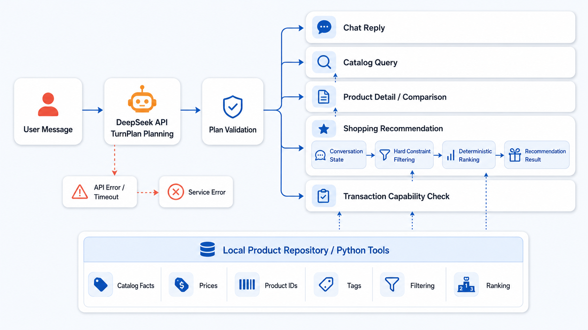
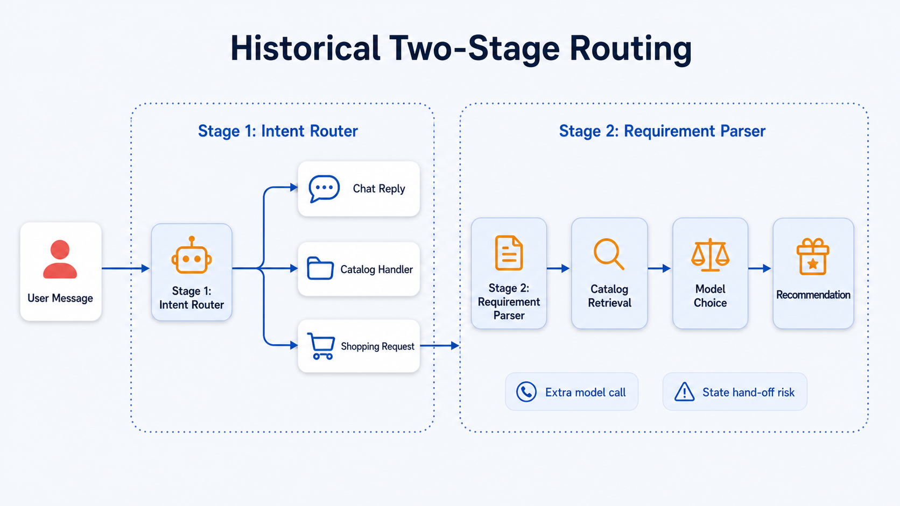

# 智能购物 Agent 实验报告

## 摘要

本项目实现了一个基于 DeepSeek API 与本地商品目录的购物 Agent 原型。系统以大模型完成自然语言需求理解和单轮计划生成，以程序完成目录检索、约束验证、候选排序和结果展示。商品库包含 1,740 件英文商品，公开评测集包含 50 条购物需求。最终评测中，50 条任务均得到满足显式约束的结果；界面人工核验进一步覆盖了多轮状态保持、品类切换、偏好排序、商品详情/比较及商品库浏览。

## 1. 任务目标与设计原则

题目要求构建一个能够理解购物需求、搜索商品、比较候选、判断约束并给出结果的 Agent。项目采用“模型负责语义，工具负责事实”的设计原则：大模型不直接编造商品信息，也不直接决定最终商品；本地程序不替代大模型理解用户意图。

系统实现了以下主干能力：

- 理解中英文购物需求，并将其转换为受限的结构化计划；
- 基于商品类型、预算、标签/主题和厂商进行检索与约束检查；
- 支持候选比较、商品详情、目录统计和多轮需求更新；
- 对推荐依据、过滤数量和候选排序保留可审阅记录；
- 对未实现的交易动作明确说明能力边界，不伪称已经下单或支付。

## 2. 大模型使用方式

系统通过环境变量配置 DeepSeek API。每轮用户输入由模型生成一个受限的 `TurnPlan`，其中包括任务目标（`chat`、`information`、`selection`、`action`）、目标对象、需求字段、目录操作和状态动作。程序对该计划进行枚举值、字段组合和目录提示校验；若只是 JSON/协议格式不合规，系统会在无副作用阶段尝试一次协议修复。

模型的职责是识别用户意图、解析约束角色，并提供经过目录验证的中英文规范值提示。例如，“马克杯”可对齐为 `mug`，“海洋主题”可对齐为 `Ocean`。模型服务出现连接、认证、限流或超时问题时，本轮直接返回服务错误，不以本地规则伪造模型理解或生成离线推荐。

## 3. Agent 工作流设计

```text
用户消息
  → DeepSeek 生成 TurnPlan
  → 计划契约校验 / 一次协议修复
  ├─ chat / none                 → 自然语言回复
  ├─ information / catalog       → 目录聚合或范围查询
  ├─ information / product       → 商品详情或商品比较
  ├─ selection / catalog         → 状态归约 → 硬过滤 → 确定性排序 → 推荐
  └─ action / transaction        → 能力注册表检查
```

对于推荐任务，系统先将新消息归约到当前会话需求，再用本地目录执行硬约束过滤。硬约束包括商品类型、预算、明确主题和明确厂商；“优先”“喜欢”等偏好不作为硬过滤，而参与候选排序。候选按“已验证偏好命中情况 → 价格从低到高 → 商品 ID”稳定排序，因而在同一数据和同一约束下可以复现。

图 1 展示了当前工作流。大模型只在计划阶段参与语义理解；随后由 Python 工具读取本地商品库、执行验证与排序。服务异常从模型规划阶段直接返回，不会触发本地推荐兜底。



## 4. 设计迭代与取舍：从两段分流到统一计划

早期设计采用两段式分流：第一阶段先把用户消息分为聊天、目录查询和购物请求；只有购物请求才进入第二阶段的需求解析、目录检索和模型选择。该设计能够直观地区分不同任务，但购物场景需要跨阶段交接分类结果和需求状态，并可能引入额外的模型调用。

在多轮测试中，目录查询与购物推荐并非总是互斥。例如，用户在补充购物条件过程中询问“衬衫有什么价位”，该轮应读取目录但不能覆盖原有的待补充购物任务。若将目录查询和购物请求置于相互独立的分流路径中，状态同步、失败回滚和上下文继承需要额外规则维持，且更容易出现职责重叠。

因此，当前方案将每轮语义判断统一为一次 `TurnPlan` 规划，再经计划契约校验路由到对应工具。它并未取消执行阶段的分支，而是将“语义判断”收敛为单一入口：目录查询、商品详情、推荐和交易动作共享同一种计划契约；`ConversationState` 与 `TaskContext` 分别维护“买什么”和“正在做什么”。正常情况下，购物推荐不再需要由第二个模型阶段决定商品，而是由目录工具按硬约束和稳定排序规则得出结果。

| 对比维度 | 历史两段式分流 | 当前统一计划工作流 |
| --- | --- | --- |
| 语义入口 | 先分类，再由购物分支二次解析 | 单次 `TurnPlan` 同时表达目标、对象和需求 |
| 购物推荐 | 需求解析、检索与模型选择分段衔接 | 状态归约后由工具执行过滤和确定性排序 |
| 状态管理 | 需要在路由与购物分支之间交接 | `ConversationState` 与 `TaskContext` 统一维护 |
| 失败边界 | 多阶段调用需分别处理失败 | 计划失败直接终止本轮；协议错误仅允许一次修复 |
| 可追溯性 | 决策分散在多个阶段 | 计划、过滤、候选和排序写入同一轮 trace |

图 2 是历史两段式分流的结构示意。图中的“Extra model call”和“State hand-off risk”用于概括其结构性成本，并不表示每次请求必然发生错误。



## 5. 状态、工具与安全边界

`ConversationState` 以事件记录需求更新，并由 reducer 得出当前购物条件。`TaskContext` 与需求状态分离，分别保存推荐收集、目录浏览、商品详情/比较和交易动作上下文。因此，诸如“衬衫有什么价位”这样的只读目录问题不会覆盖尚未完成的购物需求；明确提出新的商品类型时，系统会以新选择任务替换旧条件。

本地 `ProductRepository` 读取 `products.jsonl`，并提供以下受控工具能力：

| 工具能力 | 作用 | 事实来源 |
| --- | --- | --- |
| 目录聚合 | 统计品类、标签、价格范围和数量 | 本地商品目录 |
| 约束检索 | 过滤商品类型、预算、标签和厂商 | 本地商品目录 |
| 商品详情与比较 | 按已校验的商品 ID 返回字段 | 本地商品目录 |
| 候选排序 | 按验证后的偏好、价格和 ID 稳定排序 | 本地规则 |
| 交易动作检查 | 判断订单、支付、取消等能力是否已实现 | 能力注册表 |

目录规范值保留原始英文。中文表达只有在能对齐至目录中存在的英文值时才被视为可验证条件；未知或歧义表达会被保留为未解析状态，不能被伪装成已满足的商品事实。

## 6. 提示词与失败处理

规划提示词要求模型仅输出 JSON，并将 `goal`、`target`、目录操作、状态动作和交易动作限制在预定义词表内。提示词要求区分硬条件、软偏好和需要澄清的信息；同时，程序侧的 `RecommendationPolicy` 决定何时条件足以执行推荐，避免模型因多余追问阻断已经充分的需求。

系统把服务异常区分为配置、连接、超时、认证、限流、服务端状态、模型请求错误和无效模型输出等类别。错误信息只展示阶段和类别，不展示 API Key 或完整服务商响应。交易能力目前未实现，相关请求会明确返回“能力不可用”。

## 7. 测试设计与结果

离线回归套件共 60 项，其中 59 项通过，1 项真实 API 冒烟测试默认跳过；设置相应环境变量后才会调用真实服务。公开任务评测对 `data/tasks.jsonl` 中的 50 条需求逐项执行真实 API 规划，并验证最终商品的类型、主题、预算、严格厂商条件、可用优先厂商以及确定性排序记录。

首次 50 条评测得到 47 条通过。随后发现 A023 与 A047 是模型在需求已充分时仍给出追问标记，A035 为一次模型响应异常。系统将推荐资格统一交由 `RecommendationPolicy` 判断，并对这三条任务复测；最终任务级结果为 **50/50 通过，成功率 100%**。完整逐项结果、复测说明和人工核验记录见 [测试报告](task-evaluation.md)。

## 8. 结果分析与局限性

结果表明，受限计划与确定性工具执行的组合可以避免模型直接生成不可靠的商品事实：模型处理开放式语义，程序验证所有可枚举的目录事实和排序规则。多轮状态与任务上下文分离，则降低了目录查询或商品详情查询污染当前购物任务的风险。

项目仍有以下边界：其一，商品名称、标签和描述来自英文演示数据集，界面保留原始英文商品字段；其二，系统仅实现查询、比较和推荐，订单创建、支付和取消订单尚未实现；其三，真实 API 的时延和可用性仍受网络与服务提供方影响。上述边界均在界面或响应中显式说明，而不以虚构结果替代。

## 9. 复现方式

依赖安装、环境变量配置、启动命令与测试命令见仓库根目录 [README](../README.md)。真实 API Key 仅应保存在本地 `.env` 文件中，不应提交至版本库。
