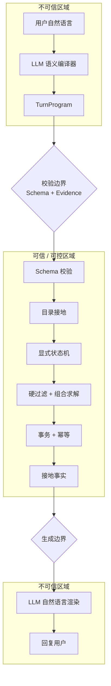
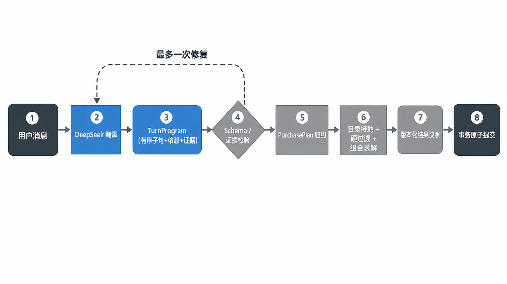
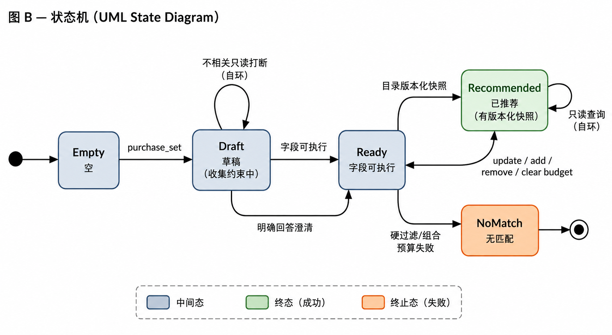
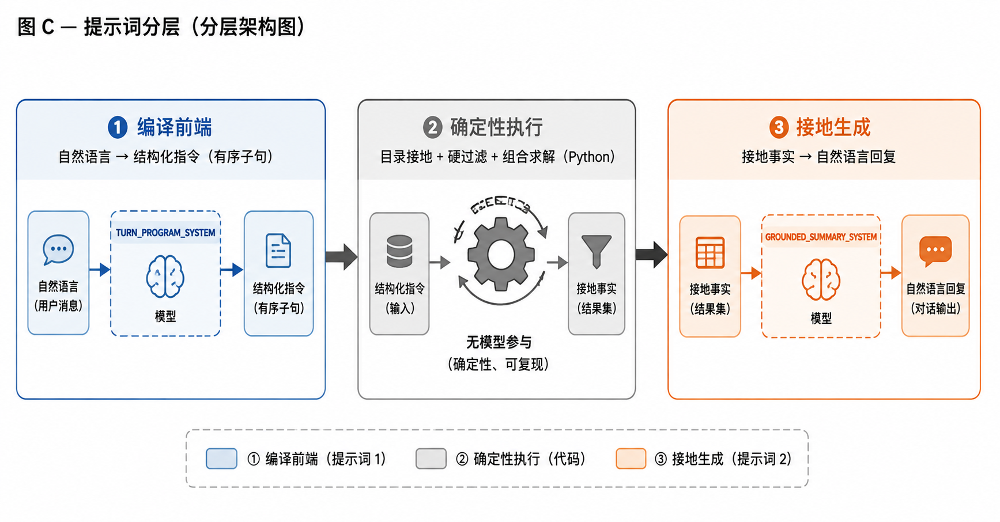

# 可靠购物 Agent：基于语义编译、显式状态机与确定性执行的系统设计

## 摘要

本文提出并实现了一个面向固定结构化目录（1,740 件商品，仅 `mug` 与 `shirt` 两类）的中英文购物 Agent。核心思想不是引入更多 LLM 能力，而是**用 LLM 处理语义不确定性、用传统程序设计消除执行不确定性**：两侧各一次模型调用（语义编译 + 自然语言渲染），中间隔着一层确定性代码，负责事实、状态与副作用。

我们把系统抽象为「LLM → CODE → LLM」三层：语义层（LLM 把自然语言编译为带证据的 `TurnProgram`）、确定性执行层（Schema 校验、目录接地、显式状态机、硬过滤、组合求解、事务）、表现层（LLM 把接地事实渲染成自然语言）。关键机制包括：语义程序的 `evidence` 约束（反幻觉）、显式状态机 `ConversationAggregate`（承载多轮中断与重入）、确定性接地（never guess）、以及 `revision` 乐观锁 + `message_id` 幂等（副作用正确性）。

实验在冻结的 50 条 held-out 测试集上取得 **94.0%** 的通过率（47/50）；开发集（121 条）暴露并修复了 14 类「模型输出 vs Python 编译」边界缺陷。误差分析显示，绝大多数失败集中在语义边界，而非状态机、事务或检索层。这表明本设计在「小规模结构化目录」场景下，无需 RAG、ReAct 或多 Agent 即可实现可靠的多轮购物交互。

## 1. 引言

### 1.1 问题定义

给定一个固定、结构化的商品目录（1,740 件，两个互斥类型），构建对话式购物 Agent 的难点**不在信息检索**——目录可以全部载入内存——而在五类语义与执行问题：

1. **自然语言歧义**：用户用「小清新」「海边」「复古风」这类模糊主题，必须映射到目录真实标签，且不能错配。
2. **复合意图**：「比较 A 和 B，把便宜的加购物车」需要在一轮内表达多个有依赖关系的动作。
3. **多轮状态**：用户在选购中途追加/修改/取消约束，甚至插入只读问题，状态必须保持一致。
4. **接地执行**：模型不能虚构商品、价格、库存；所有事实必须能追溯到目录。
5. **副作用正确性**：收藏/下单等账户动作必须原子、幂等，双击或重试不能重复执行。

### 1.2 旧设计的失败

早期实现（单意图 `TurnPlan` + 事件溯源 + 前置正则）暴露四类结构性缺陷：

1. **单意图上限**：每轮只能表达 `goal=chat|information|selection|action` 五选一，无法表达单轮多动作。
2. **复杂句绕过模型**：前置正则直接回复若干分支，复杂句可能命中错误分支，绕过大模型的语义理解。
3. **只读查询被误当澄清答案**：澄清中插入的只读问题可能被当成对澄清的回答。
4. **副作用与状态分离**：副作用与状态更新分离，重试产生重复副作用。

### 1.3 设计目标

对应上述问题，我们确立四个设计目标：

- **G1 可表达**：一轮内能表达多个有依赖的动作（复合意图）。
- **G2 可验证**：模型输出必须经过结构化校验，状态变更/账户动作必须携带用户原话证据。
- **G3 可接地**：所有事实（类型、主题、厂商、价格）只能由确定性代码从目录推导，模型不能编造。
- **G4 可恢复 / 幂等**：多轮状态可中断可重入；账户副作用原子提交、按消息 ID 幂等。

### 1.4 研究问题（RQ）

- **RQ1**：语义编译能否提升复杂购物请求的可执行性？（单轮多动作、结果引用、条件执行）
- **RQ2**：显式状态机能否提高多轮购物过程的一致性？（澄清、中断、恢复、修改计划）
- **RQ3**：确定性执行能否约束 LLM 导致的事实与副作用错误？（虚构商品、错误过滤、重复下单）
- **RQ4**：这种可靠性需要付出多少性能代价？（时延、模型调用次数、token）

## 2. 系统概览

系统的中心思想是**可信边界（Trust Boundary）**：明确「在哪里允许模型自由，在哪里绝对不允许模型自由」。

**图 1：可信边界（Trust Boundary）**



图 1 所示的流水线可以进一步抽象为**三层架构**：

| 层 | 职责 | 模型是否参与 |
|---|---|---|
| 语义层（Semantic Layer） | 把自然语言编译为 `TurnProgram` | LLM #1（只理解，不能执行） |
| 确定性执行层（Deterministic Execution） | 校验、接地、状态、过滤、求解、事务 | 无（纯 Python） |
| 表现层（Presentation Layer） | 把接地事实渲染成自然语言 | LLM #2（只表达，不能决定事实） |

即 **LLM → CODE → LLM**：两侧模型职责完全不同，中间的代码是事实、状态与副作用的唯一来源。



## 3. 语义编译

### 3.1 为什么从「分类」变成「编译」

旧系统让模型输出一个扁平对象，`goal` 只能四选一（`chat / information / selection / action`）——本质是「分类器」，把一句话塞进一个桶。但真实请求常是复合的：「比较 A 和 B，把便宜的加购物车」包含两个有依赖的动作，分类器无法表达。所以改为让模型输出一个**有序子句数组**（`clauses`）：每条子句是一个动作，数组顺序即执行顺序。这是从「分类」到「编译」的根本转变。

**为什么还需要 `relations`（依赖关系）？** 子句数组只能表达「顺序」，但有些依赖不是简单顺序，而是「引用前序结果」或「条件执行」：例如「把便宜的加购物车」里的「便宜的」要引用「比较」的结果（用 `result_reference`），「如果没找到就推荐别的」要用 `conditional_non_empty` 门控。若让模型隐式地把「引用哪个结果」写进 payload，容易出错；显式 `relations` 让依赖可被校验。

每轮 DeepSeek 输出一个有序、受限的 `TurnProgram`，根键固定为 `schema_version`、`primary_act`、`clauses`、`relations`：

- **`clauses`**：有序数组（≤8 个），18 种子句（15 种核心 + 3 种只读查询 `order_query / favorite_list / cart_query`）。
- **`relations`**：子句间依赖，仅 `before`（顺序）、`result_reference`（引用前序结果）、`conditional_non_empty / conditional_empty`（条件门控）。
- **`evidence`**：任何状态变更或账户动作子句，必须携带用户原话的**精确子串**。

### 3.2 为什么 `evidence` 是反幻觉的硬闸门

模型可能「自作主张」——用户只是问「能买吗」，模型却生成下单动作。`evidence` 要求任何状态变更/账户动作子句必须携带用户原话的精确子串，否则直接判 `invalid_model_output`。这把「模型不能做用户没要求的事」从一句软约束，变成了**一条硬校验规则**——从源头杜绝「模型自作主张执行账户动作」。

### 3.3 具体过程：一次编译-执行

以「比较 P0005 和 P0011，把便宜的加购物车」为例，完整流程：

1. **模型编译**：DeepSeek 输出 `TurnProgram`，含 `[product_query(比较), cart_add(加购)]` 两个子句，`cart_add` 用 `result_reference` 指向 `product_query`。
2. **Schema 校验**：Python 校验每个子句 payload 是否合规、`evidence` 是否存在于原话。
3. **逐条执行**：`product_query` 查目录得到两件商品 → `cart_add` 引用上一步结果，把便宜的那件编译成 `cart.add` effect。
4. **结果组装**：比较结果 + 加购 effect 一起返回。

模型只参与第 1 步，后三步全是确定性代码。

### 3.4 校验与接地：为什么

- **为什么 Schema 校验**：模型的 JSON 输出不可靠（可能漏字段、加未知字段），JSON Schema 是硬兜底——不合规直接拒绝并触发一次修复，不让脏数据流入执行层。
- **为什么确定性接地（never guess）**：若让模型自己把「小清新」映射成标签，它可能映射错（如把「动画风」映射成 Nature）。所以只让 Python 从别名表 + 名称/描述做确定性匹配，命中不了就澄清。**宁可少召回，也不错过滤。**
- **检索优先于追问**：只要类型已知就检索真实商品并报告如何收窄，而非先追问预算或主题。

## 4. 状态执行

### 4.1 为什么用「显式聚合」而不是「事件溯源」

旧系统用**事件溯源**：记一条条事件（用户每句话），回答前用 `_reduce_requirement()` 从头重放事件、推导当前状态。这在「逐步追加约束」时没问题，但遇到**中断语义**就撑不住：用户在澄清中途插一句「你们有多少种主题」，重放事件时很难判断这句话是「回答澄清」还是「只读查询」，容易把状态算错。

所以改成**显式聚合**：不存事件流水账，而是直接存一个「当前状态」对象。状态是「直接持有的」，不是「现算的」——中断、重入、修改都一目了然。

| 字段 | 含义 |
| --- | --- |
| `active_plan` | 唯一活动采购计划（`PurchasePlan`），含多条 `line` |
| `pending_change_set` | 澄清中挂起的未完成变更 |
| `pending_clarification` | 待澄清问题（含 `interruption_policy`） |
| `current_result_snapshot` | 版本化推荐结果快照 |
| `catalog_version` | 目录内容哈希 |

### 4.2 为什么需要「澄清挂起」和「版本化快照」

- **澄清挂起（`pending_clarification` + `pending_change_set`）**：澄清时用户要「挂起」未完成的变更。例如用户说「送人礼物」，系统问「马克杯还是T恤」，这时不能把「礼物」这个需求丢掉——它挂在 `pending_change_set` 里，等用户回答类型后再一起重建。`interruption_policy="preserve_on_read_only"` 保证中间插入的只读查询不会消费掉这个挂起的变更。
- **版本化快照**：推荐结果带 `plan_version` + `catalog_version`。因为目录可能被管理员修改——若旧推荐快照还被当新事实用，就会出现「推荐的商品已下架」的错误。带版本号，目录一变旧快照就失效。

### 4.3 具体过程：一次状态转移

以「我想买马克杯 → 换成T恤」为例：

1. 第 1 轮 `purchase_set`：建立采购计划，状态 Empty → Draft（计划含 `mug` 行）。
2. 第 2 轮 `purchase_set(mode=replace)`：计划归约把 `mug` 行替换为 `shirt` 行，`plan_version` 递增。
3. 确定性推荐：按新计划检索 `shirt`，生成版本化快照，状态 → Recommended。



## 5. 确定性执行与事务

- **硬过滤 + 组合求解**：硬约束过滤 + 有界深度优先搜索（visited 上限 100,000）求解合计预算下的多条目组合，保持目录偏好序。
- **能力注册表**：`capability` 显式声明 `payment/inventory/shipping/returns/external_info` 为假、`catalog/recommendation/favorite/cart/order` 为真；具体问询诚实拒绝。
- **账户副作用**：收藏/加购/下单/取消编译为 `effects`，在同一个 SQLite 事务里与会话状态一起提交。
- **幂等与并发**：`revision` 乐观锁（`WHERE revision = ?`）检测冲突；`message_id` 幂等去重；`BEGIN IMMEDIATE` 保证「购物车清空 + 订单创建」原子。
- **账户读写对称**：对话既能写（收藏/加购/下单/取消），也能读（查订单/收藏/购物车）。

## 6. 提示词策略

### 6.1 为什么用两个 prompt 而不是一个

系统的「理解」和「表达」是两端，中间隔着确定性执行。若用一个 prompt 让模型「直接生成最终答复」，模型就会同时做「理解 + 决策 + 表达」——而「决策」恰恰是我们要从模型手里收回的。所以拆成两个：

- 第一个 prompt 只让模型「理解」→ 输出结构化 `TurnProgram`（模型不能做决策）。
- 第二个 prompt 只让模型「表达」→ 把接地事实渲染成自然语言（模型不能决定事实）。

提示词不是事实来源，也不拥有状态。

### 6.2 为什么 schema + 规则双重约束

光靠「在 prompt 里写『请你别乱输出』」不可靠——模型会偶尔越界。所以用两层：

- **硬约束（JSON Schema）**：字段不对直接拒绝，是兜底。
- **软引导（语义规则）**：把「货币怎么判」「推荐N款 vs 买N件」「支付怎么路由」「送礼 recipient 怎么设」这些边界歧义写成显式规则。

这些规则不是凭空写的，而是**从实测 bug 演化来的**——「预算20以内被判 CNY」「支付被当订单」「送人的被当名字 someone」这些 bug 修复后，就各自沉淀成了 prompt 里的一条规则。所以提示词是「踩坑踩出来的」。

### 6.3 两个 prompt 的分工

- **编译前端（TURN_PROGRAM_SYSTEM）**：用 schema + 规则双重约束模型输出，把边界上的自由裁量权收回到确定性代码（货币判定、`推荐N款` vs `买N件`、支付→capability、送礼→recipient null、换一批→exclude_shown 等）。
- **接地渲染（GROUNDED_SUMMARY_SYSTEM）**：把接地后的事实（商品名、标签、价格）喂给模型生成自然语言，铁律是「只使用给定事实、绝不编造」，并区分 `selected`（主推荐）与 `options`（备选）。



## 7. 实验方法

### 7.1 数据集

固定目录 1,740 件商品（`mug` 870 / `shirt` 870），353 个标签，其中 44 个有中文别名。环境：`deepseek-v4-pro`，`DEEPSEEK_THINKING_ENABLED=false`，`temperature=0.1`，`max_tokens=4096`，编译预算 30 秒，SDK 不自动重试。

### 7.2 测试集

- **Development set（121 条）**：71 条 A-O 结构化矩阵 + 40 条边界扫描 + 10 组多轮对话，用于暴露问题、修改提示词与接地逻辑。
- **Held-out set（50 条）**：冻结后一次性运行，未参与任何调优，用于评估泛化。

### 7.3 对照基线

Baseline 为旧单意图 `TurnPlan` 系统（§1.2 所述四类缺陷）。由于该架构已移除，本文以「旧设计的已知结构性缺陷」作为定性 baseline，以新系统的 held-out 通过率作为量化结果。

### 7.4 指标

意图路由正确性、接地正确性、状态正确性、副作用正确性、端到端通过率、时延。失败按 `model / protocol / state / catalog / transaction / UI` 六类归因。

## 8. 结果

### 8.1 冻结测试集

冻结的 50 条 held-out 测试集：**47/50 = 94.0%** 通过，3 条失败（见 §9）。

### 8.2 分维度结果

| 维度 | 通过 |
| --- | --- |
| 意图路由 | ✅ |
| 约束接地（主题/预算/厂商） | ✅（含「小清新→Nature」「Strawberry→Strawberries」名称匹配） |
| 多轮状态（换类型/删约束/清预算/只读隔离/澄清重入） | ✅ |
| 复合请求（比较+加购、组合） | ✅ |
| 账户副作用（写+读、幂等） | ✅ |
| 中英混合 / 送礼 / 边界异常 | ✅ |

### 8.3 时延

关思考模式后，单轮端到端（一次语义编译 + 一次接地渲染）约 **1.5–2.3 秒**。

## 9. 错误分析：Agent 在哪里失败？

### 9.1 开发阶段发现并修复的 14 类缺陷

全部落在「模型输出 vs Python 编译」的语义边界，均可归因到某类机制：

| 缺陷 | 归因机制 |
| --- | --- |
| 「预算20以内」判 CNY / 「送人的」当名字 `someone` | 接地缺失（货币/收礼人） |
| 「都出售什么」无文案 / 「一共有多少种主题」误判 | 执行层文案/分支 bug |
| 「推荐三款」漏 purchase_set / 「支付」当订单 | 子句路由（prompt 规则） |
| 小清新/海边不识别 / Strawberry 不匹配 | 别名覆盖 + 名称匹配 |
| 空消息报错 / 组合后下单无法解析 | 边角处理 |
| 账户只能写不能读 / 换一批不换商品 / 回复机械 | 功能缺失（读子句 / exclude_shown / 接地生成） |

### 9.2 冻结测试集的 3 个失败

1. **「便宜一点的马克杯」** → 被当成硬性主题澄清。相对价格偏好（「便宜」）未被识别为价格排序，而是被当成主题约束。
2. **「马克杯和 T 恤，预算 20」** → 直接按合计预算推荐，未澄清「每件 20 还是合计 20」。
3. **「不要海洋也不要复古的马克杯」** → 双重否定被误路由到 `line_update`（改计划），而非 `purchase_set`（新选购）。

这三类失败仍属「语义边界」，未发现状态机、事务或检索层的功能错误。这一误差分布印证了设计哲学：**把模型的自由压缩到可校验的编译前端，把波动挡在事实之外**。

## 10. 讨论

- **RQ1（语义编译能否提升可表达性）**：是。`TurnProgram` 的有序子句 + `result_reference` 让「比较后加购」这类复合请求在单轮内可表达；held-out 中复合请求全部通过。
- **RQ2（状态机能否提升一致性）**：是。显式聚合 + 中断/重入/版本化，让多轮换类型、删约束、清预算、只读打断、澄清重入都保持一致；held-out 中多轮状态全部通过。
- **RQ3（确定性执行能否约束幻觉与副作用）**：是。`evidence` + 确定性接地 + 事务幂等，杜绝了虚构商品、错误过滤、重复下单；held-out 中账户副作用全部通过。
- **RQ4（性能代价）**：每轮两次模型调用（编译 + 渲染），单轮约 1.5–2.3 秒；相比单次调用多一次渲染，但换来了可解释、可审计的自然语言回复。

关于「为什么不用 RAG / ReAct / 多 Agent」：本项目的目标**不是证明这些技术无效**，而是验证——在当前固定 1,740 件结构化目录的场景中，无需引入这些组件，也能实现可靠的多轮购物交互。这是**设计选择（engineering rationale）**，而非普遍结论。

## 11. 效度威胁

- **内部效度**：开发集（121 条）参与了提示词与接地逻辑的调优，held-out（50 条）虽冻结，但二者由同一作者设计，可能存在措辞偏差。
- **外部效度**：仅覆盖 `mug` / `shirt` 两类、1,740 件商品；结论不保证推广到更大、更多类型的目录。
- **模型依赖**：`TurnProgram` 的可靠性依赖 DeepSeek V4 Pro 的结构化输出能力；换模型可能改变边界失败率。
- **数据偏差**：353 个标签中仅 44 个有中文别名（约 12%），中文模糊主题的覆盖有限，可能低估了接地失败率。
- **样本规模**：held-out 仅 50 条，94% 的置信区间较宽；更大规模的冻结测试集可进一步提高结论稳健性。

## 12. 结论

本工作提出并验证了一个**用语义编译 + 确定性执行构建可靠购物 Agent** 的方案。核心贡献是确立了「LLM 处理语义不确定性、代码消除执行不确定性」的可信边界：语义层把自然语言编译为带证据的 `TurnProgram`，确定性执行层负责校验、接地、状态、过滤、求解与事务，表现层把接地事实渲染成自然语言。实验表明，该设计在冻结 held-out 集上取得 94% 通过率，且失败集中在语义边界而非状态机或事务层——证明在小规模结构化目录场景下，无需 RAG/ReAct/多 Agent 也能实现可靠的多轮购物交互。

## 13. 可复现性

```bash
pip install -r requirements.txt
cp .env.example .env          # 设置 DEEPSEEK_API_KEY，DEEPSEEK_THINKING_ENABLED=false
python -m uvicorn starter.api:app --reload --port 8000
cd frontend && npm install && npm run dev

python tests/_ao_live.py       # 结构化样例（开发集，真实 DeepSeek）
python tests/_edge_sweep.py    # 边界扫描（开发集）
python tests/_heldout.py       # 冻结 held-out 测试集
```

数值与通过率应在固定模型、日期、commit 下重新运行后记录，不应以本报告历史结果替代新一次验收。
