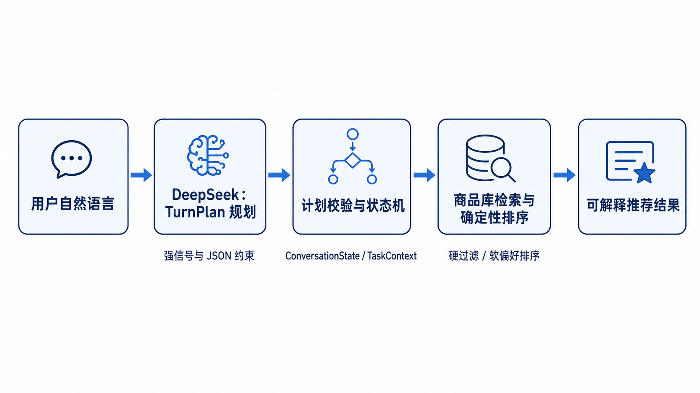
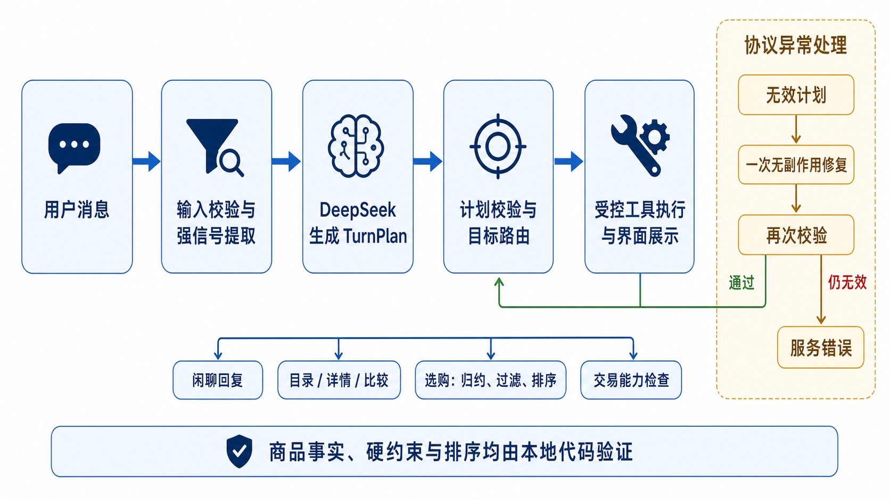
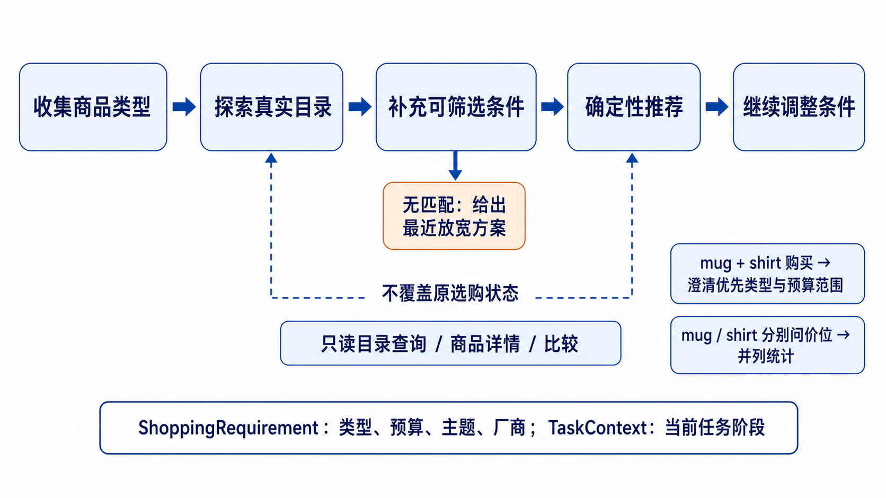

# 智能购物 Agent 实验报告

## 摘要

本项目实现了一个面向离线电商商品库的自然语言购物 Agent。系统以 DeepSeek 为语义规划器：模型将用户当轮表达转换为受限的 `TurnPlan`，但不直接生成商品事实或决定最终商品；本地 Python 代码负责目录接地、硬约束验证、候选排序、会话状态迁移和结果解释。该分工使系统既能理解中英文自然语言，又能保证类型、预算、主题、厂商和商品详情均可由 `products.jsonl` 复核。

系统覆盖题目要求的需求理解、商品搜索、候选比较、约束检查、购买决策和结果说明，并实现多轮填槽、主动引导、状态隔离、无结果解释和交易能力边界。商品库包含 1,740 件商品，其中 `mug` 与 `shirt` 各 870 件。2026-08-10 的完整离线测试运行 117 项，其中 116 项通过、1 项真实 API 冒烟测试按默认配置跳过；历史真实 API 公开任务评测为 50/50 通过。本文不将历史 API 结果与本次离线测试混为同一批测量，而分别说明其证据范围。

**关键词：** 大语言模型；Agent；结构化规划；商品检索；多轮对话；约束验证

## 1. 任务要求与问题定义

题目要求构建一个可运行购物 Agent，完成需求理解、商品搜索、候选比较、约束检查、购买决策与结果说明；模型选择、提示词、工具编排和失败处理可自行设计，多轮对话和主动追问属于可选增强。本项目将任务转化为如下问题：如何让模型理解开放式购物表达，同时不让模型替代商品库事实和确定性决策。

数据集不提供训练集/验证集划分，仅提供商品库与 50 条公开模拟需求。每个商品含 `product_id`、`name`、`item_type`、`manufacturer`、`price`、`tags` 与 `description`。因此，本系统只把能够映射到这些字段的条件作为可验证约束；对“Disney 主题”等目录无法接地的硬条件，系统必须明确报告不可满足，而非生成看似合理的商品。

本项目的目标如下：

1. 将中英文自然语言转化为可审计的意图与需求增量；
2. 仅依据本地商品库返回商品事实、统计、详情和比较；
3. 支持用户逐轮补充类型、预算、主题和厂商，而不是要求一次输入完整条件；
4. 把聊天、目录查询、详情、比较、推荐和交易请求放入不同的受控路径；
5. 在模型输出异常、无匹配或能力未实现时安全失败，并保留可解释记录。

## 2. 大模型使用方式

### 2.1 调用配置与职责边界

系统通过 OpenAI 兼容 SDK 调用 DeepSeek API，`base_url` 为 `https://api.deepseek.com`。模型名由环境变量 `DEEPSEEK_MODEL` 配置；示例环境文件使用 `deepseek-v4-flash`，代码在未设置时默认 `deepseek-v4-pro`。调用温度固定为 `0.2`，超时和重试次数由 `DEEPSEEK_TIMEOUT_SECONDS` 与 `DEEPSEEK_MAX_RETRIES` 控制。

模型的唯一核心职责是生成**单轮声明式计划**：判断用户当前是聊天、查询、选购还是交易请求，并抽取需求增量及状态操作。模型不读取商品库、不计算商品数量、不选择商品 ID，也不生成未经验证的价格、厂商或标签。这样可将模型的开放语义能力与程序的可验证能力分离。

| 能力 | 由模型完成 | 由本地代码完成 |
| --- | --- | --- |
| 意图理解 | 解释中英文表达、判断本轮目标和需求增量 | 强意图信号预处理与计划一致性检查。 |
| 需求规范化 | 提出类型、主题、厂商、预算等候选含义 | 与目录规范值匹配，未知硬条件标记为不可满足。 |
| 商品事实 | 不生成 | 检索、计数、详情、比较、价格范围和标签统计。 |
| 推荐决策 | 不指定商品 ID | 硬过滤、软偏好计分、价格与 ID 稳定排序。 |
| 交易 | 可识别动作类型 | 依据能力注册表拒绝未实现的订单、支付和取消。 |

### 2.2 结构化输出与失败处理

API 使用 `response_format={"type": "json_object"}` 要求模型返回 JSON 对象。`TurnPlan.from_dict()` 随后校验字段类型、枚举和组合关系；例如 `goal=selection` 必须使用 `target=catalog` 并携带需求，`goal=action` 必须使用交易目标和受限动作词表。

这不是“只靠提示词”的 JSON 约束：服务端 JSON 对象、Python 数据类校验、强意图一致性检查和目录接地共同构成多层防线。项目当前未调用服务商原生 `json_schema` 模式；若迁移到支持该模式的接口，可将 `TurnPlan` 契约进一步表达为服务端 Schema，但跨字段约束和目录事实验证仍须保留在代码侧。

如果模型计划无效，系统只在尚未检索、尚未写入业务状态时进行一次无副作用协议修复；修复仍无效则返回带失败阶段和错误类别的 `service_error`，不会用本地猜测伪造推荐。

## 3. Agent 总体架构与工作流



系统由四层组成。

| 层次 | 组件 | 输入与输出 | 责任 |
| --- | --- | --- | --- |
| 交互层 | `app.py`、Streamlit | 用户消息、对话、商品卡片、Trace | 即时显示用户消息与加载状态；按“回复—条件—卡片—依据”呈现结果。 |
| 规划层 | DeepSeek、`TurnPlan` | 自然语言 → 受限 JSON 计划 | 识别语义，不产生商品事实。 |
| 编排层 | `ShoppingAgent`、`ConversationState`、`TaskContext` | 计划 → 受控路由 | 检查输入/计划、更新状态、决定澄清、探索或推荐。 |
| 数据与决策层 | `ProductRepository` | 需求 → 目录事实/候选/排序 | 目录接地、检索、统计、详情比较、无结果近似方案和稳定排序。 |

### 3.1 主工作流



一次完整回合按以下顺序运行：

1. 接收用户消息，先检查空输入、倒置价格区间等明确输入错误；
2. 提取商品 ID、比较词、目录查询词、交易词等强意图信号；
3. 对少量高置信场景直接处理，例如无类型的礼物请求、显式开放式直接推荐、活动选购中的预算补充或泛化“推荐一个”续接、“同轮购买 mug 和 shirt”的组合购买澄清，以及两类商品的并列价位查询；其余场景调用 DeepSeek 生成 `TurnPlan`；
4. 校验计划结构及其与强信号的一致性，必要时只修复一次；
5. 按计划路由到聊天、目录查询、商品详情/比较、选购或交易能力检查；
6. 若为选购，重放状态事件得到当前需求，接地为商品库规范值，执行硬过滤和确定性排序；
7. 输出主回复、筛选条件、商品证据及可展开 Trace。

图 2 展示的是进入模型规划的通用路径；第 3 步中的高置信直达分支会在模型调用前返回受控结果。无论走哪一条路径，模型输出都是“下一步做什么”的提议，而不是“商品是什么”的证据。所有对用户可见的商品事实都来自受控工具执行结果。

### 3.2 状态机与多轮填槽



系统将状态分为两类：

- `ShoppingRequirement` 保存“要买什么”：商品类型、预算、主题、厂商及其硬约束/偏好强度；
- `TaskContext` 保存“正在做什么”：活动任务、选购阶段、最近选中商品、候选列表和最近只读查询目标。

| 当前状态/条件 | 触发输入 | 下一状态 | 系统行为 |
| --- | --- | --- | --- |
| 无商品类型 | `我想买礼物` | `collecting` | 只询问 mug 或 shirt，不要求一次补全所有字段。 |
| 已知类型、无细化条件 | `我想买一个马克杯` | `exploring` | 展示真实价格范围、常见主题和目录样例，主动提示可补充的筛选维度。 |
| 已知类型且有筛选条件 | `Ocean主题，预算20元以内` | `recommended` | 归约状态、接地、硬过滤、排序后返回推荐结果。 |
| 明确开放式选择 | `不限预算和风格，直接推荐一个` | `recommended` | 允许默认排序直接给出一个商品。 |
| 无候选 | `预算8元以内` | `no_match` | 报告无匹配，给出仅放宽一个条件的最近可达方案。 |
| 目录查询/详情/比较 | `有什么价位`、`介绍 P0005` | 保留原选购状态 | 以只读方式执行，不覆盖活动 `ShoppingRequirement`；后续带明确筛选条件，或仅说“推荐一个”时均可复用当前选购条件。 |
| 同轮多类型购买 | `我想买马克杯和 T 恤，预算20以内` | `collecting` | 不将两类商品合并检索；先询问优先处理的类型及预算是单件上限还是合计预算。 |
| 多类型只读价位查询 | `mug 和 shirt 分别有什么价位？` | 保留原选购状态 | 绕过单类型映射，分别返回两类商品的数量、最低价与最高价；不触发组合购买澄清。 |
| 新类型请求 | `改成 Snow主题T恤` | 新选购任务 | 使用 `replace` 清除旧类型、主题、预算和厂商。 |

选购需求的变化记录为事件；检索前由 reducer 重放这些事件得到当前 `ShoppingRequirement`。`TaskContext` 则保存当前任务阶段和最近只读查询上下文。因此，“想买 T 恤 → 查询 T 恤价位 → 预算低于 20”不会因中间目录查询丢失 T 恤条件，而明确换成马克杯或 T 恤时又不会让旧条件泄漏。

## 4. 提示词与工具设计

### 4.1 `TurnPlan` 提示词契约

系统提示要求模型仅返回一个 JSON 对象，核心字段如下。

| 字段 | 合法值/结构 | 作用 |
| --- | --- | --- |
| `goal` | `chat` / `information` / `selection` / `action` | 本轮目标。 |
| `target` | `none` / `catalog` / `product` / `transaction` | 目标对象。 |
| `requirement` | 类型、厂商、价格、主题、澄清信息 | 用户表达的需求增量，不含商品事实。 |
| `catalog_operations` | `count`、`list`、`price_range`、`group_by_tag` 等 | 只读目录查询允许的操作。 |
| `state_action` | `none` / `merge` / `replace` | 如何更新选购状态。 |
| `selection_mode` | `criteria` / `explicitly_open` | 区分带条件推荐与明确允许默认选择。 |
| `action` | 受限交易动作词表 | 只用于能力检查，不直接执行交易。 |
| `goal_evidence` | 本轮原文片段 | 为高风险动作保留用户授权证据。 |

提示词还给出“目录查询与选购”的对照例：`衬衫都有什么价位？` 是只读目录查询；`推荐一件 T 恤，预算 30 以内` 是选购。它要求把 `prefer`、`喜欢`、`优先`标记为偏好，而把明确类型、预算、主题和“必须某厂商”标记为硬约束。

以“`Ocean主题马克杯，预算20元以内`”为例，模型计划只描述用户需求增量，不含候选商品或商品事实。下例为字段完整性说明，空字段可在实际响应中为 `null`：

```json
{
  "goal": "selection",
  "target": "catalog",
  "requirement": {
    "item_type": {
      "raw_value": "mug",
      "constraint_strength": "hard",
      "catalog_hint": "mug"
    },
    "manufacturer": null,
    "price_constraint": {"operator": "<=", "value": 20},
    "concepts": [
      {
        "raw_value": "Ocean",
        "kind": "theme",
        "constraint_strength": "hard",
        "catalog_tag_hints": ["Ocean"]
      }
    ],
    "needs_clarification": false,
    "clarification_question": null
  },
  "catalog_operations": [],
  "state_action": "merge",
  "selection_mode": "criteria",
  "action": null,
  "goal_evidence": ["Ocean主题马克杯", "预算20元以内"]
}
```

随后，代码将 `mug`、`Ocean` 和价格上界映射至目录规范值，再完成筛选和排序；因此 `P0005` 等商品 ID 不属于模型计划字段，也不由模型指定。

提示词不能单独保证正确性，因此代码补充了少量高置信规则：识别商品 ID 的比较/详情/交易请求；解析中英文价格区间；识别 `Ocean主题` 等拉丁标签与中文后缀连写；以及对“单一类型 + 不限条件 + 直接推荐”的开放式请求直接进入推荐。这些规则只覆盖歧义较低的形态，常规自由文本仍交给模型规划。

### 4.2 受控工具与验证链

| 工具/模块 | 输入 | 输出 | 关键约束 |
| --- | --- | --- | --- |
| `ProductRepository.ground` | 结构化需求 | 目录规范值与映射 Trace | 不可映射硬条件进入 `unresolved_hard_constraints`。 |
| `retrieve` | 已接地需求 | 候选与逐层数量 | 依次应用类型、硬厂商、价格和硬主题过滤。 |
| 目录统计工具 | 目录过滤与操作集合 | 数量、价格范围、标签/厂商分布 | 仅返回本地目录事实。 |
| 商品详情/比较 | 有效商品 ID | 详情事实、价格/厂商/标签并列卡片 | 只读，不改变选购状态；商品描述可在详情查询中查看。 |
| `rank_candidates` | 合格候选 | 推荐商品与候选 Trace | 按已验证偏好、价格、商品 ID 稳定排序。 |
| `closest_alternatives` | 零结果需求 | 单一约束放宽后的最近商品 | 不把近似方案伪装为原条件匹配。 |
| 能力注册表 | 交易动作 | 可用/不可用说明 | 订单、支付、取消订单当前均不可用。 |

### 4.3 解释设计

每轮 Trace 记录输入信号、模型计划、约束更新、状态归约、目录接地、过滤漏斗、候选比较和决策验证。界面不把全部内部 JSON 强加给用户：先用自然语言说明推荐原因，再显示已应用条件与商品卡片；需要时可展开核验记录。这使“为什么推荐这件商品”和“系统如何保证条件正确”分别对普通用户和评阅者可见。

## 5. 实验设计

### 5.1 自动化测试

离线测试命令为：

```bash
python -m unittest discover -s tests -v
```

截至 2026-08-10，结果为 117 项运行、116 项通过、1 项真实 API 冒烟测试跳过。离线测试不依赖 API Key，重点检验目录真实性、状态迁移、路线正确性和近期修复不会回归。

对于公开 50 条任务，可使用：

```bash
python tests/task_evaluation.py --output outputs/task-evaluation.json --markdown-output outputs/task-evaluation.md
```

脚本会逐条检查返回商品是否满足公开任务中可由目录验证的类型、主题、预算和厂商条件，并检查候选排序 Trace 是否为确定性执行。已有的 2026-08-08 真实 API 历史运行最终记录为 50/50 通过；本次未因文档整理重新调用 API，因此将该记录视为历史实验结果。

### 5.2 人工对话与界面测试

人工测试覆盖能力介绍、类型探索、中英文预算、价格区间替换、倒置区间、只读查询、类型替换、硬/软厂商、无匹配、未知主题、开放式直接推荐、组合购买澄清和界面呈现。完整输入与期望结果见[测试用例](test-report.md)。

测试时记录完整对话、推荐商品 ID、筛选条件文字和 Trace，以区分规划错误、状态错误、目录接地错误、排序错误或展示错误。

## 6. 结果与分析

| 证据层次 | 结果 | 可支持的结论 | 边界 |
| --- | --- | --- | --- |
| 当前离线套件 | 116/116 可执行测试通过；1 项真实 API 冒烟跳过 | 目录、状态、路由、价格区间、主动引导和近期修复的逻辑可回归验证。 | 不衡量真实 API 网络稳定性。 |
| 历史公开任务评测 | 50/50 通过（2026-08-08） | 在该次真实 API 运行中，公开需求的显式目录约束与确定性排序均通过检查。 | 历史结果需在相同模型/网络条件下重新运行才能更新。 |
| 早期人工截图审查（初版编号 A1–A18） | 14 项截图观察通过；4 项发现缺陷后补充修复与回归 | 发现了单元测试之外的语言与 UI 问题，并转化为可执行回归用例。 | 初版编号仅用于说明迭代来源；当前可执行输入与预期统一见测试用例文档。 |
| 最新覆盖性人工回归与补充回归 | “只读查询后的泛化续问”和“双类型并列价位查询”已修复；新增中英文离线回归均通过 | 人工测试用于发现路由缺口，随后以不依赖模型的受控分支和回归测试闭环。 | 仍应在下一次界面发布时按测试用例手工确认呈现。 |

### 6.1 典型缺陷与改进价值

早期人工审查发现四类有代表性的问题：能力介绍可能夸大交易能力、混排主题可能未进入硬过滤、无结果的放宽说明可能自相矛盾、以及明确开放式请求可能仍进入探索。四个问题均被转化为最小范围的代码修复和自动化回归测试。该过程说明，Agent 质量不能只用“最终推荐碰巧正确”衡量；计划、状态和验证依据应共同正确，才能保证结果在不同商品排序下仍可靠。

### 6.2 人工回归发现的路由缺口及闭环

人工测试曾定位两条路由缺口。其一，目录查询使用只读分支后，活动 `ShoppingRequirement` 的事件与 `TaskContext` 虽会保留，但用户仅输入“给我推荐一个”时，系统未必复用当前选购条件。修复后，只有在 `active_task=selection`、已有商品类型且输入严格匹配中英文泛化直推短语时，代码才生成 `selection_mode=explicitly_open` 的合并计划；它复用已有类型、主题、预算和厂商，而不会把新条件误当作旧状态。

其二，“`mug 和 shirt 分别有什么价位？`”属于两类独立的只读事实查询，不是组合购买。修复后，组合购买检测优先处理含购买/推荐动词的输入；无购买意图的双类型价位问题则直接按类型分别统计数量、最低价和最高价，并以表格呈现。两条路径均不调用模型，也不会改写活动选购状态；已加入中英文离线回归。

## 7. 局限性与后续工作

1. 商品数据为英文演示目录，中文别名和模糊主题的覆盖度仍有限；复杂表达可能需要更系统的实体规范化。
2. 系统未接入真实库存、订单、支付、物流、用户账户和个性化反馈，因此交易动作只能诚实拒绝。
3. 外部模型调用仍可能受网络、限流和响应格式影响；系统能安全失败，但不能消除服务时延。
4. 当前组合购买（同时购买 mug 和 shirt）仅提示分别处理；后续可扩展为子任务分解、合计预算分配与组合比较。
5. 当前主动引导基于目录统计和固定策略；若接入点击/收藏反馈，应增加用户授权、隐私和解释机制。
6. 当前多类型只读查询仅覆盖“分别询问价位”的并列统计；若后续支持多类型标签、厂商或交叉分面查询，仍需引入更通用的多作用域目录查询数据结构。

## 8. 结论

本项目采用“模型做受限语义规划、代码做目录事实与决策”的分层方式，实现了面向本地商品库的自然语言购物 Agent。`TurnPlan` 将模型输出限制为可校验的回合计划；`ShoppingRequirement` 通过事件归约承载多轮填槽，`TaskContext` 隔离选购与只读查询；目录接地、硬约束过滤和稳定排序则保证推荐结论能回溯到 `products.jsonl`。

现有证据表明，项目的目录、状态、路由和核心约束逻辑具备离线回归基础，且历史真实 API 任务评测已记录为 50/50 通过。人工回归定位的“只读查询后的泛化推荐续接”和“双类型并列价位查询”已以受控分支和中英文离线回归闭环。后续工作可在此基础上评估更通用的多类型查询、组合购买分解和真实订单能力，而不应直接将尚无执行器的交易操作伪装为可用功能。

## 9. 复现与提交材料

项目运行、环境变量和目录结构见根目录[README](../README.md)。提交所需的代表性界面截图位于 `docs/screenshots/`；它们包括目录查询不覆盖选购状态、类型切换、偏好厂商排序、核验依据、商品详情/比较和商品库浏览。完整测试输入与期望结果见[测试用例](test-report.md)。
