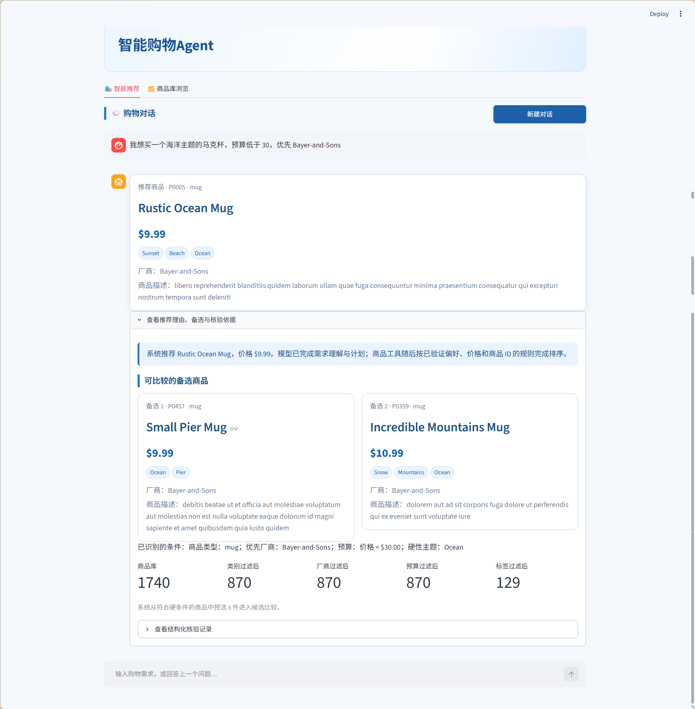
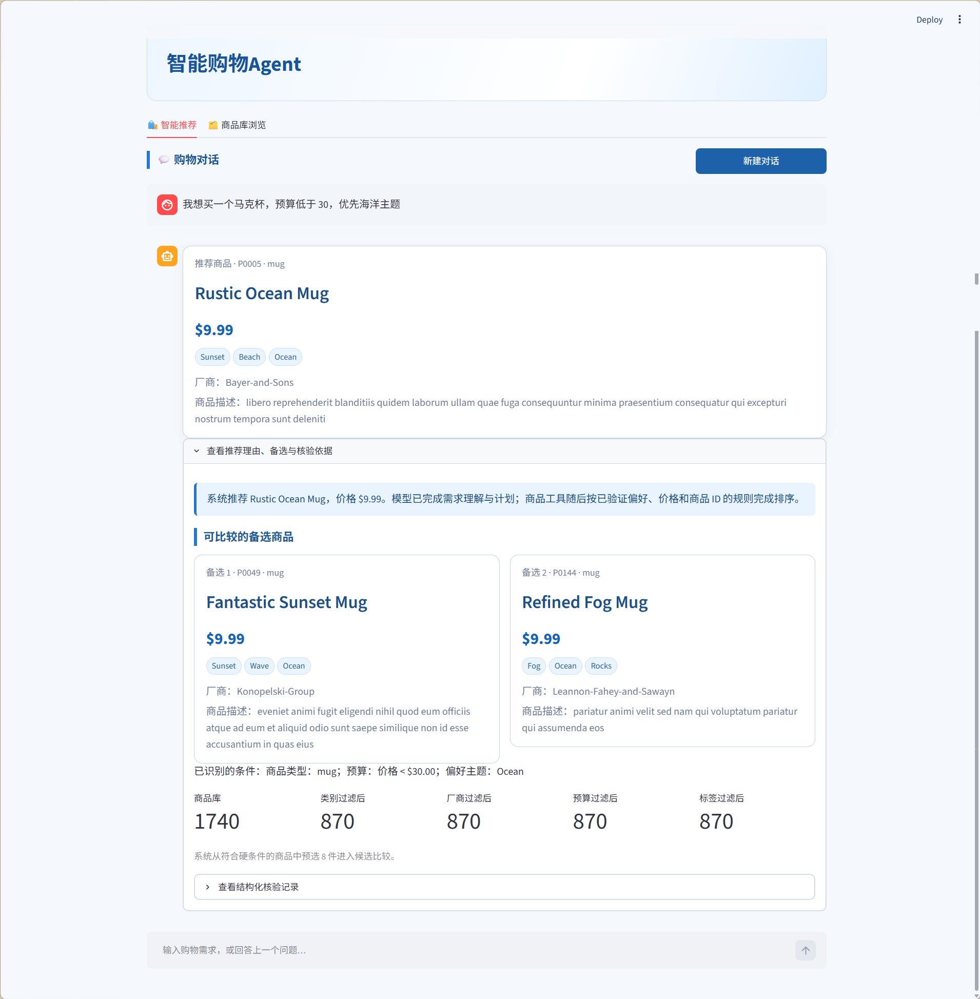
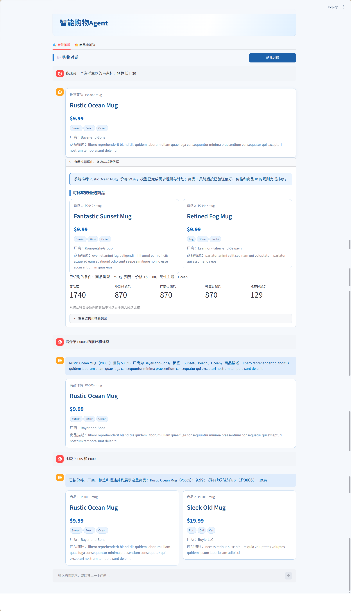
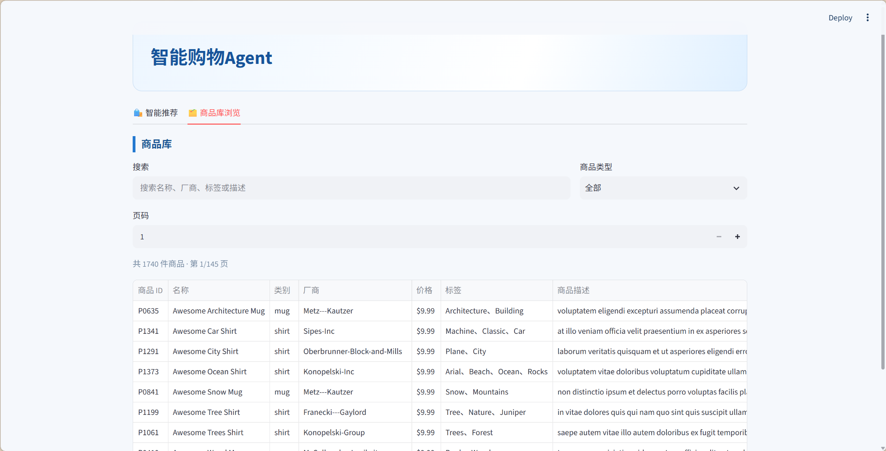

# 代表性人工运行记录

以下场景在 Streamlit 页面中人工执行。它们与 [test-cases.md](test-cases.md) 中的场景对应，用于补充自动化评测无法直接呈现的多轮交互和界面证据。

## R01：目录浏览不覆盖购物任务

输入：

```text
我想买一件T恤
衬衫有什么价位？
预算低于20元
```

结果：第一轮正常追问；第二轮返回 shirt 的真实价格范围；第三轮仍延续 T 恤任务并给出低于 20 的商品推荐。

核验：目录查询为只读任务，未清空待补充的选择状态。


## R02：新类型自动开启新选择任务

输入：

```text
我想买一件纽约风的衬衫，预算30元以内
推荐一个马克杯，我喜欢清新风格
```

结果：第一轮推荐带 `New York` 标签的 shirt；第二轮直接切换为 mug 推荐，不要求使用“改成马克杯”的固定句式。

核验：旧的 shirt、预算和 New York 条件不会泄漏到 mug 任务；未映射的“清新风格”只可作为未验证偏好说明。


## R03：硬主题与优先厂商

输入：

```text
我想买一个海洋主题的马克杯，预算低于30，优先 Bayer-and-Sons
```

结果：推荐 `P0005 · Rustic Ocean Mug`，价格 `$9.99`，标签包含 `Ocean`，厂商为 `Bayer-and-Sons`。

核验：商品类型、主题、预算通过硬过滤；厂商为软偏好并在存在满足条件的候选时优先。



## R04：软偏好参与确定性候选排序

输入：

```text
我想买一个马克杯，预算低于30，优先海洋主题
```

结果：展开推荐依据后，页面展示候选商品、硬过滤数量和结构化 trace；海洋主题作为软偏好参与候选排序。

核验：trace 的 `candidate_comparison.handler` 为 `deterministic_ranking`；排序顺序为已验证偏好、价格、商品 ID，推荐不依赖第二次模型选择。



## R05：商品详情与比较

输入：

```text
请介绍 P0005 的描述和标签
比较 P0005 和 P0006
```

结果：详情页返回 P0005 的真实字段；比较页并列展示 P0005 与 P0006 的价格、厂商、标签和描述。

核验：两轮均为只读商品信息操作，不会重新推荐、改变商品 ID 或污染购物状态。



## R06：商品库浏览

操作：切换至“商品库浏览”页面。

结果：页面展示 1,740 件商品的分页列表，并提供名称、厂商、标签或描述的关键词搜索，以及按 `mug`、`shirt` 等商品类型筛选。

核验：商品库页面直接由本地结构化数据驱动，浏览操作不依赖模型调用，也不会改变推荐对话的购物状态。



> 截图文件的固定命名和放置位置见 [`screenshots/README.md`](screenshots/README.md)。
